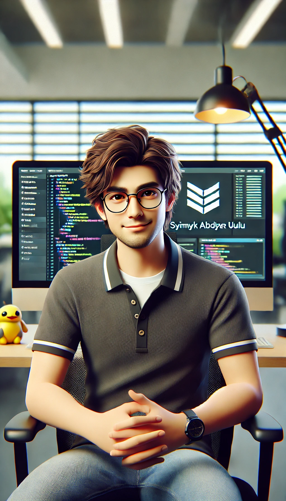

# Syimyk Abdybek uulu - Flutter Developer

Welcome to my Flutter development portfolio! This repository showcases my skills and projects as a mid-level Flutter developer.

## Profile

**Name:** Syimyk Abdybek uulu  
**Location:** Osh, Kyrgyzstan  
**Contact:** +996 (708) 450282  
**Email:** abdybekuulusyimyk@gmail.com  

## Professional Summary

I am an experienced Flutter Developer with more than 3 years of hands-on experience in mobile app development. Skilled in transforming concepts into high-quality, functional applications with a strong background in mentoring junior developers. I am currently focused on building scalable, user-centric solutions in dynamic environments.

## Projects

### Student
An educational app designed to support students in Kyrgyzstan.  
[Google Play](https://play.google.com/store/apps/details?id=student.kg)

### myQuran
A comprehensive Quran app with features for reading and learning.  
[Google Play](https://play.google.com/store/apps/details?id=myquran)

### Tilbil
A language learning app focused on the Kyrgyz language.  
[Google Play](https://play.google.com/store/apps/details?id=tilbil.kg)

## Key Skills

- **Dart and Flutter Development**  
  Proficient in using Flutter CLI, creating responsive and material widgets, and implementing clean architecture principles.
- **State Management Techniques**  
  Experienced with Bloc, GetX, and Provider for efficient state management in Flutter apps.
- **Backend Integration**  
  Capable of integrating Firebase, using REST APIs, and setting up Web Sockets for real-time applications.
- **Version Control**  
  Skilled in Git for version control and familiar with repo hosting services like GitHub.

## Languages

- **Russian:** Upper Intermediate (B2)
- **English:** Elementary (A2)

## About Me

I am a passionate Flutter Developer with a strong foundation in mobile app development and a keen interest in mentoring and teaching. My commitment to creating user-friendly, high-performance applications is matched by my dedication to fostering the next generation of developers. I thrive in dynamic environments and am always eager to take on new challenges and opportunities for growth.

